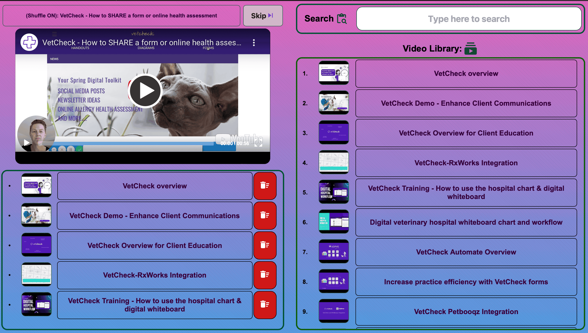

# VetCheck Player
This is a stripped version of my other repository `Craig Music Player`. It has even further stripped version `Vetcheck-Player-min` that just plays the video in full screen and skips to the next one upon ending.

## Description
VetCheck Player is a multimedia player application designed specifically for veterinary clinics. It allows veterinarians and clinic staff to easily manage and play educational videos and presentations for pet owners.

## Features
- Starts straight with a shuffle and will loop through the playlist
- If a video is queued, it will play immediately after the current video
- Once the playlist is empty, it will shuffle again
- Prevent queueing of same video or currently playing video
- 4 sections - video, queue, search, and library
- Designed for yotube streaming
- Database is stored as JSON with videoID, title & thumbnail
- Use database_creator.js to parse youtubeURL to JSON
- Auto-fullscreen after 8 seconds of inactivity
- Click on the thumbnail or title to queue the video
- Search functionality to scan local library, otherwise search youtube
- Host-server is needed only for initial load of the JS < 40KB.
- Every library is CDN hosted and files are cached for client-side-rendering.
- The player can keep running even if host-server is down.

## Installation and Usage
1. Clone the project.
2. Start any server like xampp, node, php or python.
3. All PHP codes were changed to HTML and JS.

## Contribution
Contributions are welcome! If you have any ideas, suggestions, or bug reports, please open an issue or submit a pull request.

## Contact
For any inquiries or support, please contact the project maintainer at [sedhain.pankaj@gmail.com](mailto:sedhain.pankaj@gmail.com).

## Demo

